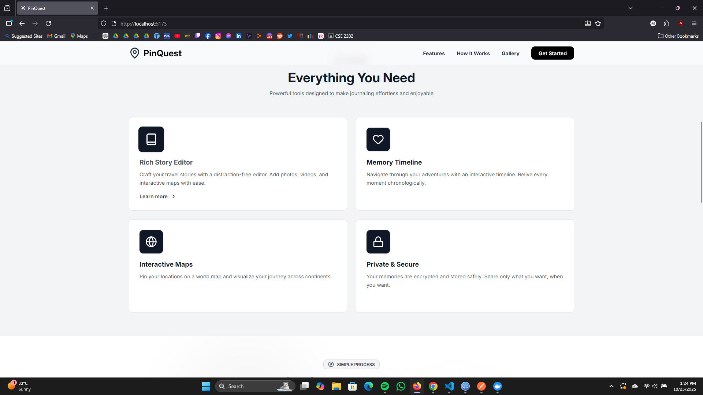

# 📍 PinQuest: The Digital Travel Journal

## Table of Contents

1. [Overview](#1-overview)
2. [Features](#2-features)
3. [Tech Stack](#3-tech-stack)
4. [Installation and Setup](#4-installation-and-setup)
    - [Prerequisites](#prerequisites)
    - [Running with Docker (Recommended)](#running-with-docker-recommended)
    - [Local Setup (Manual)](#local-setup-manual)
5. [API Endpoints](#5-api-endpoints)
6. [Feature Gallery](#6-feature-gallery)
7. [Contributing](#7-contributing)
8. [License](#8-license)

---

## 1. Overview

PinQuest is a full-stack travel journaling application designed to help users document, track, and visualize their journeys around the world. Users can effortlessly create detailed journal entries, map their visited locations, and revisit memories using advanced search functionality.

This application is built with a modern, responsive frontend and a robust, scalable backend, leveraging Docker for consistent deployment.

## 2. Features

PinQuest provides the following core functionalities:

-   **Authentication:** Secure user sign-up and login utilizing a dedicated **Landing Page**.
-   **Dashboard:** Centralized hub for managing all travel data upon successful login.
-   **Journal Management (CRUD):** Users can **Create**, **Read**, **Update**, and **Delete** individual travel journals.
-   **Interactive Map:** A dedicated view showing all previously visited locations marked by pins, providing a global visualization of the user's travels.
-   **Memories Search:** A dedicated tab allowing users to filter and search journals by a specific **date range**.
-   **Profile Management:** Users can view and edit personal information in a dedicated profile section.
-   **Animated UI:** Smooth and engaging user experience powered by **Framer Motion**.

## 3. Tech Stack

| Layer                  | Technology                  | Purpose                                                                        |
| :--------------------- | :-------------------------- | :----------------------------------------------------------------------------- |
| **Frontend**           | **React.js**                | Core UI library for building a responsive and dynamic interface                |
|                        | **Tailwind CSS**            | Utility-first CSS framework for fast and adaptive design                       |
|                        | **Framer Motion**           | Library for animations and transitions to enhance UX                           |
| **Backend**            | **Node.js**                 | JavaScript runtime for building scalable backend logic                         |
|                        | **Express.js**              | Minimalist framework for API development                                       |
| **Database**           | **PostgreSQL**              | Relational database for storing user data, journals, and locations             |
| **Deployment & Tools** | **Docker / Docker Compose** | Containerization for consistent environment setup and multi-service deployment |

## 4. Installation and Setup

### Prerequisites

Before you begin, ensure you have the following installed:

-   [Node.js](https://nodejs.org/) (LTS version recommended for manual setup)
-   [Docker](https://www.docker.com/products/docker-desktop) and [Docker Compose](https://docs.docker.com/compose/) (Highly recommended)
-   A code editor (e.g., VS Code)

### Running with Docker (Recommended)

The easiest way to get the entire application running (Frontend, Backend, and Database) is using Docker Compose.

1.  **Clone the repository:**

    ```bash
    git clone https://github.com/ArafatMridul/PinQuest.git
    cd PinQuest
    ```

2.  **Configure Environment Variables:**
    Create a `.env` file in the root directory (and potentially separate `.env.development` files in the client/server directories, depending on your setup) and define necessary variables like database credentials, port numbers, and API keys (e.g., Mapbox/Google Maps API key for the map functionality).

    Example `.env` (Root Directory):

    ```
    # Database Configuration
    POSTGRES_USER=myuser
    POSTGRES_PASSWORD=mypassword
    POSTGRES_DB=travel_journal_db
    DB_PORT=5432

    # Server Configuration
    PORT=8000
    SECRET_KEY=your_jwt_secret

    # Frontend Configuration
    REACT_APP_MAP_API_KEY=your_map_key
    ```

3.  **Build and Run Containers:**
    This command builds the images and starts the three services (client, server, database).

    ```bash
    docker compose up -d
    ```

4.  **Access the Application:**
    Once the containers are up, the application should be accessible at:
    ```
    http://localhost:[Your Frontend Port, typically 3000]
    ```

### Local Setup (Manual)

If you prefer to run the client and server separately, follow these steps:

#### A. Database Setup

1.  Ensure a local PostgreSQL instance is running.
2.  Create a database named `travel_journal_db`.
3.  Run necessary migrations or seed scripts defined in the backend directory.

#### B. Backend (Node/Express) Setup

1.  Navigate to the server directory:
    ```bash
    cd Backend
    ```
2.  Install dependencies:
    ```bash
    npm install
    ```
3.  Start the server:
    ```bash
    npm start
    ```
    The API should be running at `http://localhost:8000`.

#### C. Frontend (React) Setup

1.  Navigate to the client directory:
    ```bash
    cd ../Frontend
    ```
2.  Install dependencies:
    ```bash
    npm install
    ```
3.  Start the React application:
    ```bash
    npm start
    ```
    The frontend should open in your browser, typically at `http://localhost:3000`.

## 5. API Endpoints

The backend API utilizes RESTful principles.

| Endpoint                             | Method   | Description                                    | Access  |
| :----------------------------------- | :------- | :--------------------------------------------- | :------ |
| `/users/signup`                      | `POST`   | Registers a new user.                          | Public  |
| `/users/login`                       | `POST`   | Authenticates user and returns JWT.            | Public  |
| `/journal/:userId`                   | `GET`    | Retrieves all journals for the logged-in user. | Private |
| `/journal/`                          | `POST`   | Creates a new journal entry.                   | Private |
| `/journal/edit-story/:journalId`     | `PUT`    | Updates an existing journal entry.             | Private |
| `/journal/delete-journal/:journalId` | `DELETE` | Deletes a journal entry.                       | Private |
| `/api/locations/map`                 | `GET`    | Retrieves location data for map visualization. | Private |
| `/journal/filter`                    | `POST`   | Searches journals by date range.               | Private |
| `/users/profile`                     | `GET`    | Retrieves user profile information.            | Private |
| `/users/profile/insert`              | `PUT`    | Updates user profile information.              | Private |

_(Note: Specific request/response bodies are detailed in the API documentation located in the `/server/docs` folder.)_

## 6. Feature Gallery

A visual showcase of **PinQuest’s** key features.  
Click on any image to view it in full size.

---

<div align="center" style="display: grid; grid-template-columns: repeat(auto-fit, minmax(300px, 1fr)); gap: 20px;">

<a href="./screenshots/homePage1-desktop.png" target="_blank">
  <p><b>🏠 Landing Page</b><br><i>Sign up and log in through a clean, animated landing view.</i></p>
  
  
  
  
  
  
</a>

<a href="./screenshots/dashboard.png" target="_blank">
  <p><b>📊 Dashboard</b><br><i>Manage all travel data and quick-access tools in one place.</i></p>
  
</a>

<a href="./screenshots/journal_management.png" target="_blank">
  <p><b>📝 Journal Management</b><br><i>Create, edit, and organize journals seamlessly.</i></p>
  
  
  
</a>

<a href="./screenshots/map_view.png" target="_blank">
  <p><b>🗺️ Interactive Map</b><br><i>Visualize every trip with map pins marking your adventures.</i></p>
  
  
  
  
  
</a>

<a href="./screenshots/memories_search.png" target="_blank">
  <p><b>🔍 Memories Search</b><br><i>Filter your memories by custom date ranges.</i></p>
  
  
  
</a>

<a href="./screenshots/profile_management.png" target="_blank">
  <p><b>👤 Profile Management</b><br><i>View and edit your personal info with a modern design.</i></p>
  
  
</a>

### 🎬 Live Demo

[](https://github.com/ArafatMridul/PinQuest/raw/main/screenshots/PinQuest.mp4)
</div>

## 7. Contributing

Contributions are welcome! If you find a bug or have an enhancement idea, please follow these steps:

1.  Fork the repository.
2.  Create a new feature branch (`git checkout -b feature/AmazingFeature`).
3.  Commit your changes (`git commit -m 'Add some AmazingFeature'`).
4.  Push to the branch (`git push origin feature/AmazingFeature`).
5.  Open a Pull Request.

## 8. License

-   @ArafatMridul
